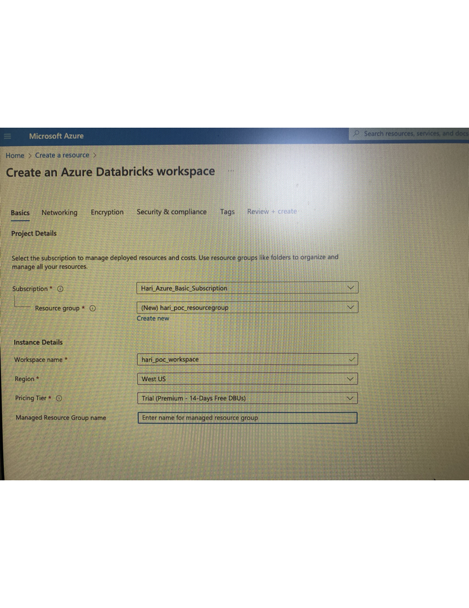
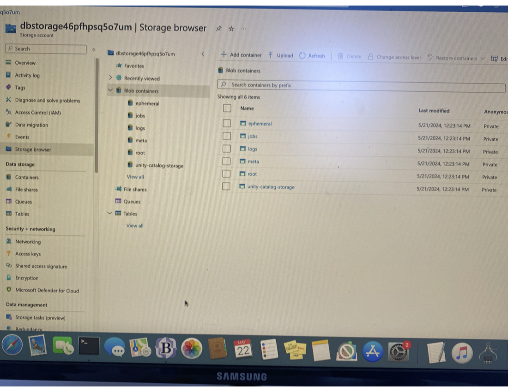
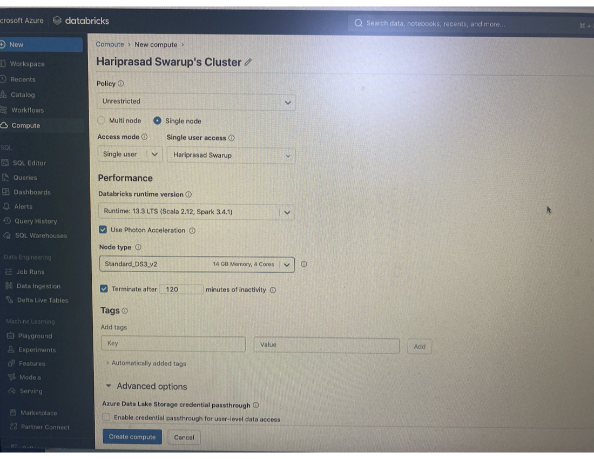
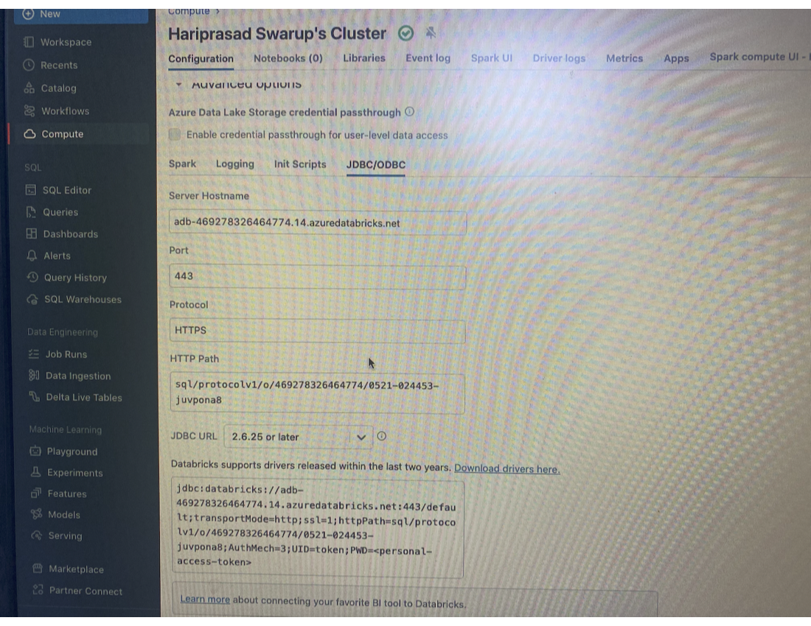

[Explore Azure Databricks](https://microsoftlearning.github.io/mslearn-databricks/Instructions/Exercises/01-Explore-Azure-Databricks.html)

(1) Updated my Azure subscription(s***9@gmail.com) from "Free Trial" to "Pay as you go"
(2) Go to portal.azure.com
	Create a resource > Analytics > Azure Databricks
		> Enter details like Resource Group and Workspace Name
		
		Workspace name - hari_poc_workspace
		Subscription - Hari_Azure_Basic_Subscription
		Resource group - hari_poc_resourcegroup
		Region - West US
		Pricing Tier - trial
		Managed Resource Group name - Networking
		Deploy Azure Databricks workspace with Secure Cluster Connectivity (No Public IP) - No
		Deploy Azure Databricks workspace in your own Virtual Network (VNet) - No
		Enable Infrastructure Encryption - No
		Enable CMK for Managed Disks - No
		Enable CMK for Managed Services - No

(3) Once you click "Create" , Wait for few minutes for the deployment to complete.

	(3b)This will automatically create a Storage Account (called "dbstorage46pfhpsq5o7um") that serve as the Storage Layer for Databricks(where dbfs:/user/hive/warehouse/ mount path points to)
		unity-catalog-storage
		root
		meta
		logs
		jobs
		ephemeral
	But we cannot access any of these "because of the deny assignment with name 'System deny assignment created by Azure Databricks"

(4) Once deployment is complete , Click on "Launch Workspace".

(5) This will take you out of "portal.azure.com" and opens something like "https://adb-469278326464774.14.azuredatabricks.net/"

(6) Create a cluster in Databricks portal - 
		Single Node Single User
		Databricks runtime version - 13.3.x-scala2.12 (Spark - 3.4.1)
		Photon Acceleration enabled(A high-performance Azure Databricks-native vectorized query enginereduces cost per workload )
		Node type - Standard_DS3_v2(1 Driver - 14 GB Memory, 4 Cores)
		1.5 DBU/h
	Click on "Create Compute"

	(6a) This will internally create 4 vCPU 14GB Memory Virtual Machines(called "5f984fc2d6a5491988c7f0e88f5643f8") that serve as All-purpose Compute Cluster for Databricks

(7)Upload Data -

Download the products.csv file from https://raw.githubusercontent.com/MicrosoftLearning/mslearn-databricks/main/data/products.csv to your local computer, saving it as products.csv.
In the sidebar, in the (+) New link menu, select File upload.
Upload the products.csv file you downloaded to your computer.
In the Create or modify table from file upload page, ensure that your cluster is selected at the top right of the page. Then choose the hive_metastore catalog and its default schema to create a new table named products.

This creates a "MANAGED" Table with the underlying file location in - dbfs:/user/hive/warehouse/products

For comparison purposes , An "EXTERNAL" table will have the location as - dbfs:/databricks-datasets/tpch/delta-001/customer

(8) In the catalog Explorer page when the products page has been created, in the Create button menu, select Notebook to create a notebook.
Opening a new notebook will automatically connect to the above Cluster

	
	
	
(11) Once the cluster is created , Go to Cluster > Configuration > JDBC/ODBC and make a note of the below -
Server Hostname - adb-469278326464774.14.azuredatabricks.net
Port - 443
Protocol - HTTPS
HTTP Path - sql/protocolv1/o/469278326464774/0521-024453-juvpona8
JDBC URL - 2.6.25 or later
Databricks supports drivers released within the last two years - jdbc:databricks://adb-469278326464774.14.azuredatabricks.net:443/default;transportMode=http;ssl=1;httpPath=sql/protocolv1/o/469278326464774/0521-024453-juvpona8;AuthMech=3;UID=token;PWD=<personal-access-token>

---------------------
How to ingest data into "raw/bronze" layer into databricks from ADLS Gen2 and export data out of databricks
----------------------
[Ingest data into databricks](https://github.com/hswarup/databricks/blob/main/SourceData_Ingestion_Into_Databricks_NB.ipynb)

===============
dbt core setup
=================
[Setup Reference](https://docs.getdbt.com/docs/core/connect-data-platform/databricks-setup?tokenoauth=token)

(1) Go to profile > Settings > Developer > Access Tokens > Generate New Token(and copy it)
dapi***00

(2) pip install dbt-databricks
change directory to project folder and run - 
dbt init(and choose databricks as option)

(3) Modify ~/.dbt/profiles.yml as below

dbt_databricks_proj:
  outputs:
    poc_databricks:
      type: databricks
      catalog: samples #optional catalog name if you are using Unity Catalog]
      schema: tpch # Required
      host: adb-469278326464774.14.azuredatabricks.net
      http_path: sql/protocolv1/o/469278326464774/0521-024453-juvpona8
      token: dapi***00 # Required Personal Access Token (PAT) if using token-based authentication
      threads: 1  # Optional, default 1
  target: poc_databricks
  
(4) Run dbt debug to test the connection

===============
dbt cloud setup
=================
[Reference](https://docs.databricks.com/en/partners/prep/dbt-cloud.html#connect-to-dbt-cloud-manually)

In this step, you create a dbt project, which contains a connection to a Databricks cluster or a SQL warehouse, a repository that contains your source code, and one or more environments (such as testing and production environments).

(a) Sign in to dbt Cloud.
Click the settings icon, and then click Account Settings.Click New Project.

For Name, enter a unique name "dbt_databricks_poc" for your project, and then click Continue.

For Choose a connection, click Databricks, and then click Next.

For Name, enter a unique name for this connection.
For Select Adapter, click Databricks (dbt-databricks).

Note - Databricks recommends using dbt-databricks, which supports Unity Catalog, instead of dbt-spark. 
By default, new projects use dbt-databricks. To migrate an existing project to dbt-databricks, see Migrating from dbt-spark to dbt-databricks in the dbt documentation.

Under Settings, for Server Hostname, enter the server hostname value from the requirements.

	For HTTP Path, enter the HTTP path value = sql/protocolv1/o/469278326464774/0521-024453-juvpona8 .
	If your workspace is Unity Catalog-enabled, under Optional Settings, enter the name of the catalog for dbt Cloud to use.
	Under Development Credentials, for Token, enter the personal access token = dapi***f00
	For Schema, Leave it blank and it uses "hive_metastore" as the default catalog and "default" as the default schema.

Click Test Connection.

If the test succeeds, click Next.

(b) Also , Link to a repository in github or choose "Managed" or use git clone(as in this case) -
A blank Repo created in github and the clone URL(ssh) is provided in dbt cloud setup screen - git@github.com:hswarup/dbt_databricks_poc.git

A ssh-key will be displayed.Copy and add that in github > ssh and gpg keys > New ssh key.
This will allow dbt Cloud to interact with github repo successfully.

---
Create and Run Models
----
Develop > Initialize dbt project > commit and sync
This will create sample model files and commit to a new branch in the chosen git repo.

Create 3 model files - diamonds_four_cs.sql,diamonds_list_colors.sql and diamonds_prices.sql under "models" directory.

dbt run --model models/diamonds_four_cs.sql models/diamonds_list_colors.sql models/diamonds_prices.sql

------------
Other Links 
------------
[dbt core tutorial](https://docs.databricks.com/en/integrations/dbt-core-tutorial.html)

[dbt databricks tutorial](https://docs.getdbt.com/guides/databricks?step=12)

[Azure Databricks Workspace](https://portal.azure.com/#@swaruphariprasad79gmail.onmicrosoft.com/resource/subscriptions/1d411f52-9b5e-400b-b216-47d92a77108f/resourceGroups/hari_poc_resourcegroup/providers/Microsoft.Databricks/workspaces/hari_poc_workspace/overview)

[Azure Databricks URL](https://adb-469278326464774.14.azuredatabricks.net/?o=469278326464774)

[DBT Cloud URL](https://cloud.getdbt.com/develop/182071/projects/369926)
