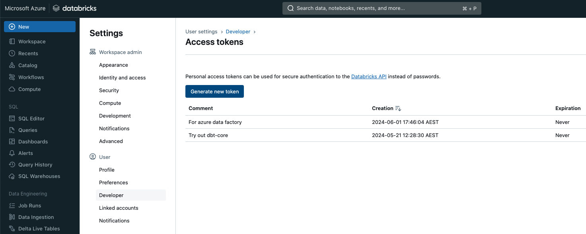
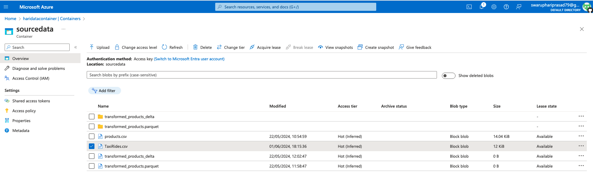
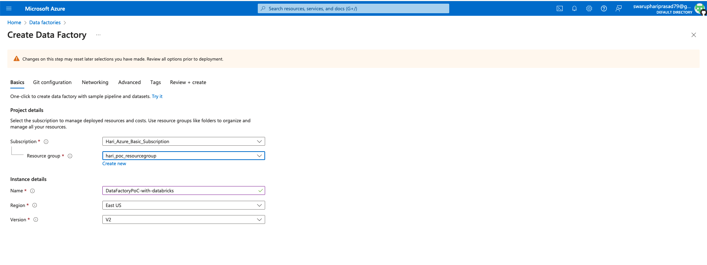
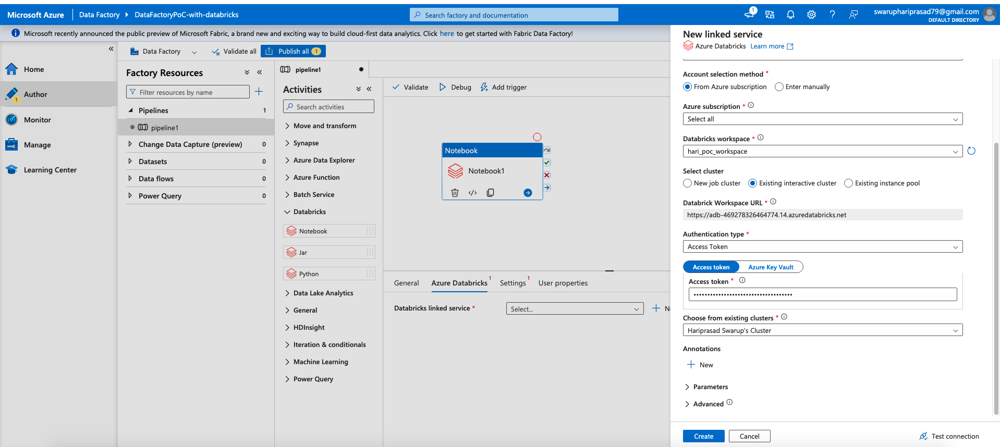
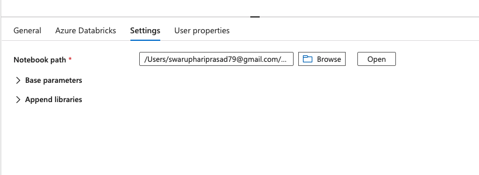
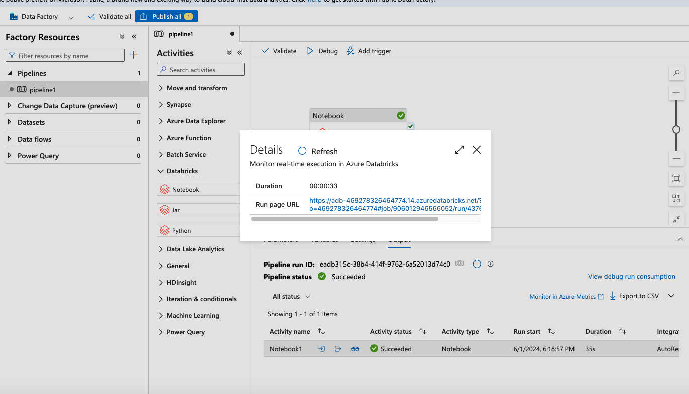
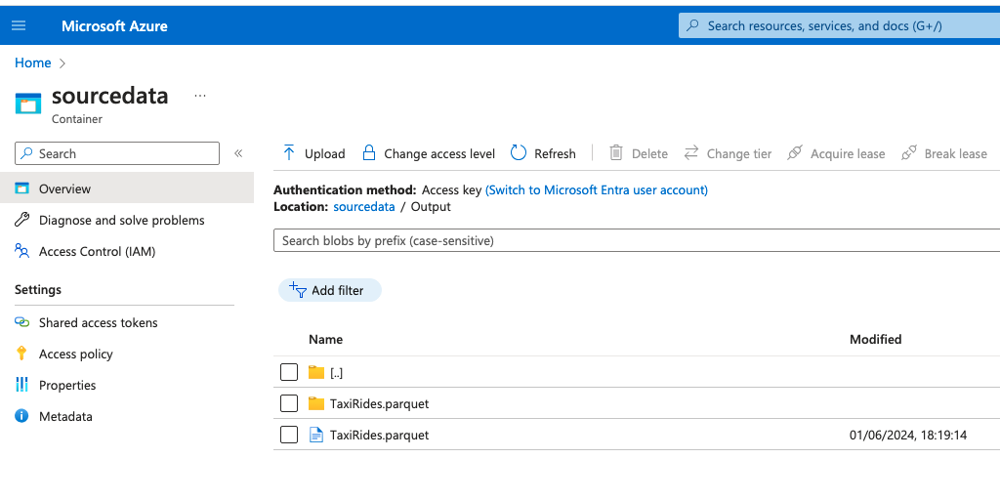
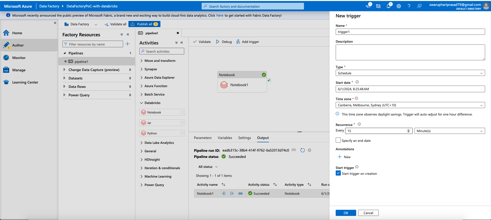

(1) Create a new token in Databricks UI - https://adb-46***4.14.azuredatabricks.net/

Setup Reference - https://docs.getdbt.com/docs/core/connect-data-platform/databricks-setup?tokenoauth=token

Go to profile > Settings > Developer > Access Tokens > Generate New Token(and copy it)
dapi***87f

(2) On portal.azure.com ,Upload the input file(from https://github.com/pluralsight-cloud/DP-203-Processing-in-Azure-Using-Batch-Solutions/blob/main/SampleDataFiles/TaxiRides.csv) onto Azure Blob Storage -
sourcedata >> TaxiRides.csv
https://haridatacontainer.blob.core.windows.net/sourcedata/TaxiRides.csv

(3) On portal.azure.com , Create a Data Factory workspace with name "DataFactoryPoC-with-databricks"
	Basic
			Subscription - Hari_Azure_Basic_Subscription
			Resource group - hari_poc_resourcegroup
			Name - DataFactoryPoC-with-databricks
			Region - East US
			Version - V2
	Networking
			Connect via - Public endpoint

Once created , Click on "Launch Studio"

(4) Create a new Data factory pipeline

Go to Author >> Create Pipeline 
Drag "Notebook" option(under Databricks) onto the Canvas.
Create a new Linked Service called "AzureDatabricksLinkedService" .
Choose Authentication Type as "Access Token" and paste the access token that we had copied earlier from Databricks.

Test connection and Create the Linked service.

Under settings , Choose the notebook "Process Taxi Rides Data" available on Databricks workspace by clicking on browse.

Reference Link - https://github.com/pluralsight-cloud/DP-203-Processing-in-Azure-Using-Batch-Solutions/blob/main/Develop%20a%20Batch%20Processing%20Solution/L25%20-%20Integrating%20Databricks/Process%20Taxi%20Rides%20Data.py

Click on debug to run it and monitor the execution.

(5) Azure Data Factory dispatches the request to Databricks where the Notebooks gets executed in Databricks workspace.
Monitor all the cell outputs.

(6) Check the Storage Container and see if the output parquet file is created.

(7) You can finally add a new trigger to schedule the pipeline to run at regular intervals.

